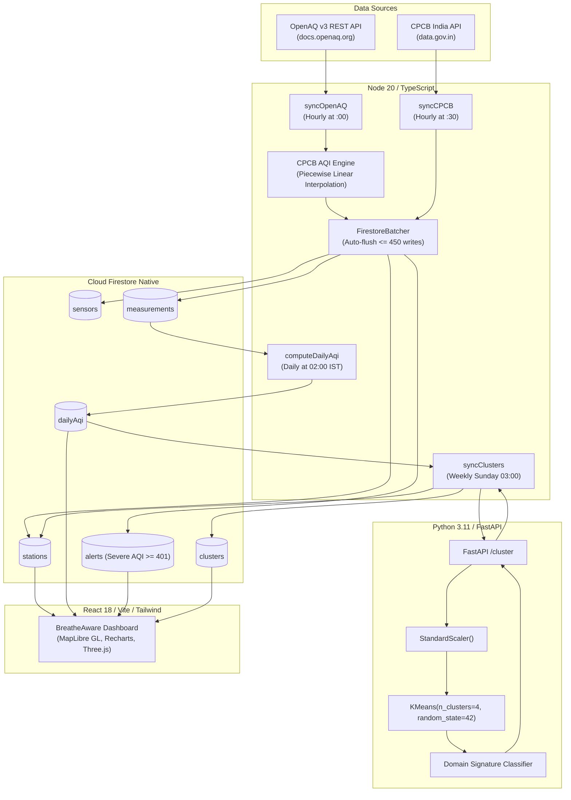

# 🌿 BreatheAware — Air Quality Index & Urban Pollution Exposure Tracker

[](LICENSE)
[](https://reactjs.org/)
[](https://vitejs.dev/)
[](https://www.typescriptlang.org/)
[](https://firebase.google.com/)
[](https://fastapi.tiangolo.com/)
[](https://scikit-learn.org/)
[](https://www.docker.com/)

> **A public-facing environmental monitoring intelligence platform.**  
> Citizens and municipal decision-makers need to know not just today's AQI number, but *which pollutants, hours, and seasons drive the worst exposure*, and *when to enact critical interventions*.

---

## 🏛️ Business Context & Objectives

Urban pollution in India is characterized by severe seasonal shifts, nocturnal thermal inversions, biomass burning spikes, and heavy industrial/traffic baselines. Standard single-number AQI summaries fail to communicate **when** exposure occurs, **what** causes it, and **how** vulnerable demographics should react.

**BreatheAware** solves this by:
1. Ingesting live ground-truth sensor feeds across India from **OpenAQ v3** and **CPCB (Central Pollution Control Board) via data.gov.in**.
2. Calculating standardized NAQI sub-indices using the official CPCB piecewise linear formula.
3. Automatically flagging emergency conditions ($\text{AQI} \ge 401$) with contextual clinical health advisories.
4. Segmenting stations into distinct urban pollution signatures using **unsupervised machine learning ($k$-Means clustering)**.
5. Providing actionable data stories directly targeted at city commissioners and policymakers for timely emergency intervention.

---

## 📸 Core Features & Dashboards

| Feature | Description |
| :--- | :--- |
| 🗺️ **Live Station Geo-Map** | High-precision geospatial map colored by official CPCB AQI bands (`#00B050`, `#92D050`, `#FFFF00`, `#FF9900`, `#FF0000`, `#800000`) instead of generic palettes. |
| 📅 **365-Day Calendar Heatmap** | Annual daily AQI timeline rendered with one row per month, highlighting severe winter spikes and seasonal transitions. |
| 🔬 **Pollutant Contribution Engine** | Sub-index breakdown for $\text{PM}_{2.5}, \text{PM}_{10}, \text{NO}_2, \text{SO}_2, \text{CO}, \text{O}_3, \text{NH}_3$, determining the exact dominant pollutant driving the daily AQI. |
| ⏱️ **Diurnal & Weekend Curves** | Hourly diurnal patterns comparing weekday rush-hour spikes versus weekend baselines and temperature inversion effects. |
| 🎯 **Exceedance & Health Counters** | Parameter selector and custom threshold counters tallying annual exceedance days and NAAQS violation percentages. |
| 🤖 **AI / ML Station Clustering** | Stateless Python microservice using $k$-Means ($k=4$) with `StandardScaler` to categorize stations into 4 archetypes: *Biomass/Crop Burning*, *Traffic/Industrial*, *Industrial/Power*, and *Clean/Background*. |
| 🚨 **Severe Alert Early Warning** | Automated real-time KPI flagging stations with $\text{AQI} \ge 401$ alongside clinical health warning tooltips. |
| 📜 **Commissioner Intervention Story** | Structured narrative arguing for targeted winter evening traffic bans and localized industrial curtailment windows. |

---

## 🏗️ System Architecture



---

## 🛠️ Technology Stack

* **Frontend**: React 18, Vite 6, TypeScript 5, Tailwind CSS, Recharts, MapLibre GL, Lucide Icons, Zustand.
* **Backend**: Firebase Cloud Functions 2nd Gen (`firebase-functions/v2/scheduler`, `firebase-functions/v2/https`), Node.js 20, TypeScript.
* **Database & Security**: Cloud Firestore Native Mode, Firebase Authentication, strict security rules, composite indexes.
* **ML Microservice**: Python 3.11, FastAPI, scikit-learn, Pydantic, NumPy, Pandas, Uvicorn, Docker.

---

## 🚀 Manual Run Instructions

Follow these step-by-step commands to run each component locally.

### Prerequisites
- **Node.js**: v20 or higher (`node -v`)
- **Python**: 3.11 or higher (`python --version`)
- **Git**

---

### Step 1: Clone the Repository
```bash
git clone https://github.com/KunalBishwal/BreatheAware.git
cd BreatheAware
```

---

### Step 2: Run the Frontend Application
In your terminal:
```bash
# 1. Install dependencies
npm install

# 2. Build for production / validation
npm run build

# 3. Start development server
npm run dev
```
Open **[http://localhost:5173](http://localhost:5173)** in your browser.

---

### Step 3: Run the Python ML Microservice
In a new terminal window:
```bash
# Navigate to ML service directory
cd breatheaware-backend/ml-service

# Install Python dependencies
pip install -r requirements.txt

# Run unit and API tests
python test_clustering.py
python test_api.py

# Start FastAPI server
uvicorn main:app --host 0.0.0.0 --port 8000 --reload
```
Interactive Swagger API docs will be live at **[http://localhost:8000/docs](http://localhost:8000/docs)**.

---

### Step 4: Run the Firebase Cloud Functions & Test Suite
In another terminal window:
```bash
# Navigate to functions directory
cd breatheaware-backend/functions

# Install dependencies
npm install

# Run automated unit test suite (AQI engine, CPCB parser, batcher, live OpenAQ)
npm test

# Build TypeScript to lib/
npm run build
```

To run Firebase emulators locally:
```bash
# In breatheaware-backend/ directory
firebase emulators:start --only functions,firestore
```

---

## 🔒 Security & Environment Variables

> [!IMPORTANT]
> **Zero-Secrets Policy**: Real API keys, credentials, and tokens are stored in `.env` files which are **strictly ignored** in [`.gitignore`](.gitignore). Never commit `.env` or `serviceAccountKey*.json` files to source control!

### Configuring `.env`
Copy the example files and supply your keys:

```bash
# Root frontend configuration
cp .env.example .env

# Backend functions configuration
cp breatheaware-backend/.env.example breatheaware-backend/.env
```

| Key | Description | Default / Source |
| :--- | :--- | :--- |
| `OPENAQ_API_KEY` | OpenAQ v3 API Key | [explore.openaq.org](https://explore.openaq.org) |
| `OPENAQ_BASE_URL` | OpenAQ v3 Endpoint | `https://api.openaq.org/v3` |
| `CPCB_API_KEY` | India Data.gov.in API Key | [data.gov.in](https://data.gov.in) |
| `FIREBASE_PROJECT_ID` | Google Cloud / Firebase Project | Your Firebase project ID |
| `ML_SERVICE_URL` | Microservice Endpoint | `http://localhost:8000` |

---

## 🧮 CPCB AQI Breakpoints & Standards

Sub-index calculation follows India CPCB National Air Quality Index (NAQI) standards:

| AQI Band | Range | Color | Health Advisory |
| :--- | :---: | :---: | :--- |
| **Good** | 0 – 50 | `#00B050` | Minimal impact. Enjoy outdoor activities. |
| **Satisfactory** | 51 – 100 | `#92D050` | Minor breathing discomfort to sensitive people. |
| **Moderate** | 101 – 200 | `#FFFF00` | Breathing discomfort to people with lungs, asthma, heart diseases. |
| **Poor** | 201 – 300 | `#FF9900` | Breathing discomfort to most people on prolonged exposure. |
| **Very Poor** | 301 – 400 | `#FF0000` | Respiratory illness on prolonged exposure. Avoid outdoor activity. |
| **Severe** | 401 – 500+ | `#800000` | Affects healthy people. Serious health impacts for vulnerable groups. Stay indoors. |

---

## 📄 License

This project is open-source and licensed under the **[MIT License](LICENSE)**.

---

## 👨‍💻 Author

**Kunal Bishwal**  
GitHub: [@KunalBishwal](https://github.com/KunalBishwal)
