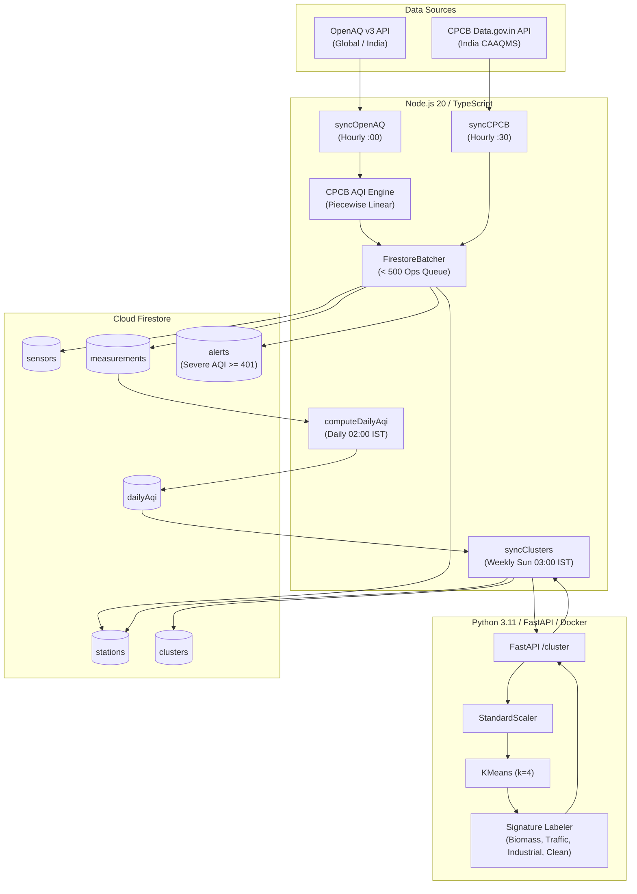

# BreatheAware Backend Infrastructure & ML Microservice

Comprehensive backend service and machine learning pipeline for **BreatheAware**, an air quality intelligence and urban pollution exposure tracking platform.

---

## 🏗️ System Architecture



---

## 📁 Directory Structure

```text
breatheaware-backend/
├── firebase.json                   # Firebase deployment configuration
├── .firebaserc                     # Active Firebase project mapping
├── .env.example                    # Environment variable template
├── firestore.rules                 # Security rules (public read, admin write)
├── firestore.indexes.json          # Composite indexes for queries
│
├── functions/                      # Firebase Cloud Functions (v2, Node 20, TypeScript)
│   ├── package.json
│   ├── tsconfig.json
│   ├── test-runner.cjs             # Automated test harness
│   ├── src/
│   │   ├── index.ts                # Function exports & on-demand triggers
│   │   ├── config/
│   │   │   ├── env.ts              # Env vars & secret manager loader
│   │   │   └── firebase.ts         # Firebase Admin SDK init
│   │   ├── services/
│   │   │   ├── openaq.service.ts   # OpenAQ v3 client (500ms throttle, backoff)
│   │   │   ├── cpcb.service.ts     # CPCB data.gov.in parser (max sub-index logic)
│   │   │   ├── aqi.service.ts      # Piecewise linear CPCB AQI engine
│   │   │   └── ml.service.ts       # HTTP client for ML Microservice
│   │   ├── triggers/
│   │   │   ├── sync.openaq.ts      # Hourly OpenAQ ingestion + severe alerts
│   │   │   ├── sync.cpcb.ts        # Hourly CPCB ingestion + severe alerts
│   │   │   ├── compute.daily.ts    # 24h aggregation into dailyAqi
│   │   │   └── sync.clusters.ts    # Weekly ML clustering pipeline
│   │   ├── utils/
│   │   │   ├── logger.ts           # Structured Pino/Cloud Logger
│   │   │   └── batcher.ts          # Safe Firestore batch queue (< 500 ops)
│   │   └── types/
│   │       └── index.ts            # Shared TypeScript data models
│   └── tests/
│       ├── aqi.service.test.ts     # Breakpoints & sub-index unit tests
│       ├── cpcb.service.test.ts    # CPCB multi-pollutant grouping tests
│       ├── batcher.test.ts         # Batch queue logic tests
│       └── openaq.live.test.ts     # Live OpenAQ v3 connectivity test
│
└── ml-service/                     # Python 3.11 FastAPI Microservice
    ├── requirements.txt            # FastAPI, scikit-learn, numpy, pandas
    ├── Dockerfile                  # Container definition for Cloud Run
    ├── main.py                     # FastAPI application & endpoints (/health, /cluster)
    ├── clustering.py               # Feature filtering, StandardScaler, KMeans
    ├── schemas.py                  # Pydantic request & response models
    ├── test_clustering.py          # Pure KMeans unit test
    └── test_api.py                 # FastAPI TestClient integration test
```

---

## 📊 Database Collections & Schemas

| Collection | Doc ID Format | Description |
| :--- | :--- | :--- |
| `stations` | `{locationId}` or `cpcb-{slug}` | Ground monitoring stations across India |
| `sensors` | `{sensorId}` or `{stationId}_{param}` | Specific sensor hardware measuring a pollutant |
| `measurements` | `{sensorId}_{YYYY-MM-DD-HH}` | Hourly raw concentration and computed AQI sub-index |
| `dailyAqi` | `{stationId}_{YYYY-MM-DD}` | 24-hr aggregated AQI, dominant pollutant, and category |
| `alerts` | `alert_{provider}_{stationId}_{hour}` | Severe air quality warnings (AQI >= 401) with health advisories |
| `clusters` | `cluster-0`, `cluster-1`, etc. | ML-derived pollution profiles and member station sets |

---

## 🧮 CPCB AQI Calculation Engine

The engine calculates sub-indices for each pollutant using the official CPCB piecewise linear interpolation formula:

$$SubIndex = \frac{BP_{high} - BP_{low}}{CP_{high} - CP_{low}} \times (Concentration - CP_{low}) + BP_{low}$$

- **Overall Station AQI**: $\max(SubIndex_{PM2.5}, SubIndex_{PM10}, SubIndex_{NO_2}, SubIndex_{SO_2}, SubIndex_{CO}, SubIndex_{O_3}, SubIndex_{NH_3})$
- **Dominant Pollutant**: The parameter yielding the maximum sub-index.
- **Alert Trigger**: Any station recording an overall AQI $\ge 401$ (Severe band) automatically generates an active record in `alerts` carrying the medical advisory:
  > *"Affects healthy people. Serious health impacts for vulnerable groups. Stay indoors."*

---

## 🤖 ML Microservice (FastAPI + scikit-learn)

- **Input**: 30-day mean levels of $PM_{2.5}, PM_{10}, NO_2, SO_2, O_3, CO$.
- **Validation**: Filters out stations missing critical parameters ($PM_{2.5}$ or $PM_{10}$).
- **Transformation**: `StandardScaler()` feature standardization.
- **Model**: `KMeans(n_clusters=4, random_state=42)`.
- **Heuristic Signature Labeling**:
  1. **Clean/Background**: Lowest overall pollution load.
  2. **Industrial/Power**: Highest $SO_2$ concentration.
  3. **Traffic/Industrial**: Highest $NO_2$ concentration.
  4. **Biomass/Crop Burning**: Highest $PM_{2.5} / PM_{10}$ concentration with low $NO_2$.

---

## 🚀 Running & Testing

### 1. Cloud Functions & Unit Tests
```bash
cd breatheaware-backend/functions
cmd /c "npm install"
cmd /c "npm test"
```

### 2. Python ML Microservice
```bash
cd breatheaware-backend/ml-service
python -m pip install -r requirements.txt
python test_clustering.py
python test_api.py
uvicorn main:app --host 0.0.0.0 --port 8000
```
